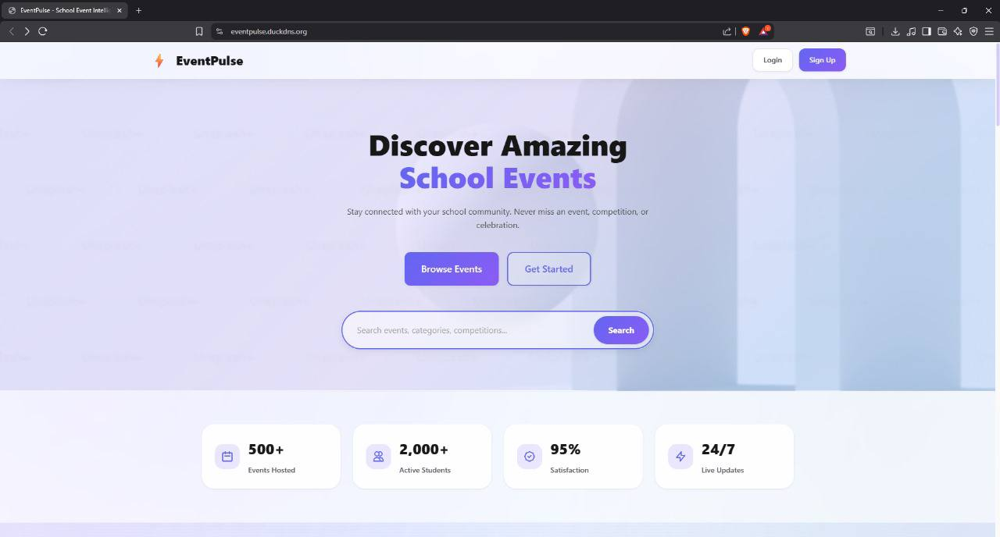

# EventPulse 🎉
 
> **A Modern Digital Command Center for School Events**  
> Built for BTUI'25 Web Development Competition
 
[](https://eventpulse.duckdns.org/)
[](LICENSE)
[](https://nodejs.org/)
[](https://reactjs.org/)
 
EventPulse is a comprehensive, full-stack event management platform designed specifically for educational institutions. It streamlines the entire event lifecycle—from creation and registration to real-time updates and attendance tracking—making school event management effortless and engaging.
 
---
 
## 🌟 Live Demo
 
**🔗 Website:** [https://eventpulse.duckdns.org/](https://eventpulse.duckdns.org/)  
**📂 Repository:** [https://github.com/pyrostack23/eventpulse](https://github.com/pyrostack23/eventpulse)
 
### 🔐 Test Credentials
 
**Admin Account:**
- **Email:** admin@gmail.com
- **Password:** Admin123#
 
**Student Account:**
- Create your own account to explore student features!
- Click "Sign Up" and register as a student to see event discovery, registration, QR codes, and more
 
---
 
## 📸 Screenshots
 
<div align="center">
  
  
</div>

<p align="center">
  <em>Mobile View</em> &nbsp;&nbsp;&nbsp;&nbsp;&nbsp;&nbsp;&nbsp;&nbsp;&nbsp;&nbsp;&nbsp;&nbsp;&nbsp;&nbsp;&nbsp;&nbsp;&nbsp;&nbsp;&nbsp;&nbsp;&nbsp;&nbsp;&nbsp;&nbsp;&nbsp;&nbsp;&nbsp;&nbsp;&nbsp;&nbsp;&nbsp;&nbsp;&nbsp;&nbsp;&nbsp;&nbsp; <em>Desktop View</em>
</p>
 
---
 
## ✨ Key Features
 
### 👨‍🎓 For Students
- **🔍 Event Discovery** - Browse upcoming events by category, date, or popularity with advanced filtering
- **📝 Quick Registration** - Register for events with just a few clicks
- **🎫 QR Code Tickets** - Receive unique QR codes for each registered event
- **📡 Real-time Updates** - Get live notifications during ongoing events via WebSocket
- **📊 Personal Dashboard** - Track registered events, attendance history, and statistics
- **🔔 Smart Notifications** - Email and in-app notifications for event reminders and updates
- **📱 Mobile-First Design** - Seamless experience across all devices
 
### 👨‍🏫 For Teachers/Organizers
- **➕ Event Creation** - Create and manage events with rich details and media
- **📸 QR Code Scanner** - Built-in scanner to mark attendance instantly
- **📢 Live Updates** - Post real-time announcements during events
- **📈 Analytics Dashboard** - View registration stats, attendance data, and engagement metrics
- **👥 Capacity Management** - Set and monitor event capacity limits with automatic waitlisting
- **📧 Bulk Communications** - Send notifications to all registered participants
- **🎨 Event Customization** - Add images, categories, and detailed descriptions
 
### 🔧 For Administrators
- **👤 User Management** - Manage students, teachers, and administrators with role-based access
- **✅ Event Moderation** - Approve, feature, or cancel events with workflow controls
- **📊 Comprehensive Analytics** - System-wide metrics on events, users, and engagement
- **🏥 System Monitoring** - Health checks, performance monitoring, and error tracking
- **🔒 Security Controls** - Rate limiting, authentication logs, and access management
- **📁 Data Export** - Export reports and analytics in various formats
 
### 🛠️ Technical Features
- **⚡ Real-time Communication** - Socket.IO for instant updates and notifications
- **🔐 Secure Authentication** - JWT-based auth with bcrypt password hashing and refresh tokens
- **🎫 QR Code System** - Unique QR codes for users and event tickets with encryption
- **📱 Responsive Design** - Mobile-first approach with progressive web app capabilities
- **📧 Email Notifications** - Automated emails for registrations, reminders, and updates
- **🖼️ Image Processing** - Sharp-powered image optimization and resizing
- **🛡️ Rate Limiting** - Protection against brute force and DDoS attacks
- **✅ Data Validation** - Comprehensive input validation and sanitization
- **🔄 Auto-scaling** - PM2 cluster mode for load balancing
- **📝 Logging** - Structured logging with Morgan and Winston
 
---
 
## 🛠️ Technology Stack
 
### Frontend
| Technology | Version | Purpose |
|-----------|---------|---------|
| **React** | 18.2.0 | Modern UI library with hooks |
| **React Router** | 6.20.0 | Client-side routing and navigation |
| **Axios** | 1.6.2 | HTTP client for API requests |
| **Socket.IO Client** | 4.6.1 | Real-time bidirectional communication |
| **Framer Motion** | 10.16.16 | Smooth animations and transitions |
| **React Toastify** | 9.1.3 | Toast notifications |
| **Chart.js** | 4.4.0 | Data visualization and charts |
| **React Chart.js 2** | 5.2.0 | React wrapper for Chart.js |
| **QRCode.react** | 3.1.0 | QR code generation |
| **jsQR** | 1.4.0 | QR code scanning |
| **date-fns** | 2.30.0 | Date manipulation and formatting |
| **React Icons** | 4.12.0 | Icon library |
| **React Modal** | 3.16.1 | Accessible modal dialogs |
| **React Calendar** | 4.7.0 | Calendar component |
 
### Backend
| Technology | Version | Purpose |
|-----------|---------|---------|
| **Node.js** | ≥16.0.0 | JavaScript runtime environment |
| **Express.js** | 4.18.2 | Web application framework |
| **MongoDB** | Latest | NoSQL database |
| **Mongoose** | 8.0.3 | MongoDB ODM with schema validation |
| **Socket.IO** | 4.6.1 | Real-time event-based communication |
| **JWT** | 9.0.2 | Secure authentication tokens |
| **bcryptjs** | 2.4.3 | Password hashing and salting |
| **Nodemailer** | 6.9.7 | Email sending service |
| **Multer** | 1.4.5 | File upload handling |
| **Sharp** | 0.33.1 | High-performance image processing |
| **node-cron** | 3.0.3 | Scheduled tasks and jobs |
| **Helmet** | 7.1.0 | Security headers middleware |
| **express-rate-limit** | 7.1.5 | Rate limiting middleware |
| **express-validator** | 7.0.1 | Input validation and sanitization |
| **Morgan** | 1.10.0 | HTTP request logger |
| **Compression** | 1.7.4 | Response compression |
| **CORS** | 2.8.5 | Cross-origin resource sharing |
| **dotenv** | 16.3.1 | Environment variable management |
 
### DevOps & Deployment
| Technology | Purpose |
|-----------|---------|
| **PM2** | Process manager with cluster mode |
| **Nginx** | Reverse proxy and load balancer |
| **MongoDB Atlas** | Cloud database hosting |
| **AWS VPS** | Virtual private server hosting |
| **Let's Encrypt** | Free SSL/TLS certificates |
| **DuckDNS** | Dynamic DNS service |
 
---
 
## 📁 Project Structure
 
```
eventpulse/
├── backend/                    # Backend Node.js application
│   ├── config/                # Configuration files
│   │   ├── database.js       # MongoDB connection setup
│   │   └── email.js          # Email service configuration
│   ├── middleware/           # Custom middleware
│   │   ├── auth.js          # JWT authentication middleware
│   │   ├── errorHandler.js  # Global error handling
│   │   └── validation.js    # Request validation middleware
│   ├── models/              # Mongoose data models
│   │   ├── User.js         # User schema and methods
│   │   ├── Event.js        # Event schema and methods
│   │   ├── Registration.js # Registration schema
│   │   └── Notification.js # Notification schema
│   ├── routes/             # API route handlers
│   │   ├── auth.js        # Authentication routes
│   │   ├── events.js      # Event CRUD operations
│   │   ├── registrations.js # Registration management
│   │   ├── analytics.js   # Analytics endpoints
│   │   ├── notifications.js # Notification routes
│   │   └── attendance.js  # Attendance tracking
│   ├── services/          # Business logic services
│   │   ├── emailService.js      # Email sending logic
│   │   ├── socketService.js     # WebSocket management
│   │   ├── qrService.js         # QR code generation
│   │   ├── cronService.js       # Scheduled tasks
│   │   └── notificationService.js # Notification handling
│   ├── utils/            # Utility functions
│   │   ├── constants.js # Application constants
│   │   └── helpers.js   # Helper functions
│   ├── uploads/         # Uploaded files directory
│   ├── .env            # Environment variables
│   ├── .env.example    # Environment template
│   ├── package.json    # Dependencies and scripts
│   └── server.js       # Application entry point
│
├── public/                    # Frontend React application
│   ├── src/
│   │   ├── components/       # Reusable React components
│   │   │   ├── Auth/        # Authentication components
│   │   │   ├── Events/      # Event-related components
│   │   │   ├── Layout/      # Layout components
│   │   │   ├── Loading/     # Loading states
│   │   │   └── Navigation/  # Navigation components
│   │   ├── context/         # React Context providers
│   │   │   ├── AuthContext.js    # Authentication state
│   │   │   └── SocketContext.js  # WebSocket connection
│   │   ├── pages/           # Page components
│   │   │   ├── HomePage.js
│   │   │   ├── EventsPage.js
│   │   │   ├── EventDetailPage.js
│   │   │   ├── DashboardPage.js
│   │   │   ├── ProfilePage.js
│   │   │   ├── AdminPanel.js
│   │   │   └── Auth/
│   │   ├── services/        # API service layer
│   │   │   └── api.js      # Axios configuration
│   │   ├── styles/         # CSS stylesheets
│   │   ├── utils/          # Utility functions
│   │   ├── App.js         # Root component
│   │   └── index.js       # Application entry
│   ├── public/
│   │   ├── index.html
│   │   └── manifest.json
│   └── package.json
│
├── ecosystem.config.js        # PM2 configuration
├── nginx-eventpulse.conf     # Nginx configuration
├── setup-monitoring.sh       # Monitoring setup
├── server-health-check.sh    # Health check script
├── optimize-production.sh    # Production optimization
└── README.md                 # This file
```
 
---
 
## 🎯 Key Functionalities
 
### Event Management
- ✅ Create events with detailed information (title, description, category, dates, location, capacity)
- ✅ Upload and optimize event images
- ✅ Set registration deadlines with automatic enforcement
- ✅ Mark events as featured for homepage display
- ✅ Cancel or complete events with participant notifications
- ✅ Add live updates during events
- ✅ Event search and filtering by category, date, status
 
### Registration System
- ✅ One-click event registration for students
- ✅ Automatic capacity checking and waitlist management
- ✅ Unique QR code generation for each registration
- ✅ Email confirmation with QR code attachment
- ✅ Registration deadline enforcement
- ✅ Cancellation with automatic waitlist promotion
- ✅ Registration history and statistics
 
### Attendance Tracking
- ✅ Built-in QR code scanner for marking attendance
- ✅ Real-time attendance updates via WebSocket
- ✅ Attendance history for students
- ✅ Export attendance reports (CSV, PDF)
- ✅ Attendance analytics and trends
- ✅ Late arrival tracking
 
### Notifications
- ✅ **Email notifications** for:
  - Event registration confirmation
  - Event reminders (24 hours before)
  - Event cancellations
  - Live updates during events
  - Waitlist promotions
- ✅ **In-app notifications** with real-time delivery
- ✅ Customizable notification preferences
- ✅ Notification history and read status
 
### Analytics
- ✅ Event statistics (views, registrations, attendance)
- ✅ User engagement metrics
- ✅ Category-wise event distribution
- ✅ Attendance trends over time
- ✅ Popular events ranking
- ✅ Registration conversion rates
- ✅ Real-time dashboard updates
 
---
 
## 🔒 Security Features
 
EventPulse implements industry-standard security practices:
 
| Feature | Implementation |
|---------|---------------|
| **Authentication** | JWT-based with secure token storage and refresh tokens |
| **Password Security** | Bcrypt hashing with 10 salt rounds |
| **Rate Limiting** | 100 requests per 15 minutes per IP |
| **Input Validation** | Comprehensive validation using express-validator |
| **XSS Protection** | Helmet.js security headers |
| **CORS** | Configured whitelist for allowed origins |
| **SQL Injection** | MongoDB's built-in protection |
| **File Upload Security** | File type, size validation, and sanitization |
| **HTTPS** | Enforced SSL/TLS encryption |
| **Session Management** | Secure session handling with httpOnly cookies |
| **Error Handling** | No sensitive data in error messages |
 
---
 
## 📱 Responsive Design
 
EventPulse is fully responsive and optimized for:
 
| Device | Resolution | Features |
|--------|-----------|----------|
| **Desktop** | 1920px+ | Full feature set, multi-column layouts |
| **Laptop** | 1024px - 1919px | Optimized layouts, all features |
| **Tablet** | 768px - 1023px | Touch-optimized, adapted layouts |
| **Mobile** | 320px - 767px | Mobile-first design, swipe gestures |
 
---
 
## 🎨 Design Highlights
 
- **Modern UI** - Clean, intuitive interface with consistent design language
- **Smooth Animations** - Framer Motion for fluid page transitions and micro-interactions
- **Color Scheme** - Professional blue (#4A90E2) and white theme with accessibility in mind
- **Typography** - Clear, readable fonts with proper hierarchy
- **Icons** - Consistent React Icons usage throughout
- **Loading States** - Skeleton loaders and spinners for better UX
- **Empty States** - Helpful messages and CTAs when no data is available
- **Error States** - User-friendly error messages with recovery options
- **Accessibility** - WCAG 2.1 AA compliant with keyboard navigation
 
---
 
## 🧪 Testing
 
The application has been thoroughly tested for:
 
✅ User registration and login flows  
✅ Event creation and management  
✅ Event registration and cancellation  
✅ QR code generation and scanning  
✅ Real-time updates and notifications  
✅ Email delivery and templates  
✅ Responsive design across devices  
✅ API endpoint functionality  
✅ Error handling and edge cases  
✅ Security vulnerabilities  
✅ Performance and load testing  
✅ Cross-browser compatibility  
 
---
 
## 📊 Performance Optimizations
 
- **Image Optimization** - Sharp for automatic image compression and resizing
- **Code Splitting** - React lazy loading for faster initial load
- **Compression** - Gzip compression for all responses
- **Caching** - Browser caching and service worker support
- **Database Indexing** - Optimized MongoDB indexes for fast queries
- **Connection Pooling** - Efficient database connection management
- **Cluster Mode** - PM2 cluster mode for multi-core utilization
- **CDN Ready** - Static assets optimized for CDN delivery
 
---
 
## 🤝 Contributing
 
This project was created for the BTUI'25 Web Development Competition. While it's a competition entry, suggestions and feedback are welcome!
 
---
 
## 📝 License
 
This project is licensed under the MIT License.
 
---
 
## 👨‍💻 Author
 
**Sadaka Parami Wijerathna**
 
- 🌐 GitHub: [@pyrostack23](https://github.com/pyrostack23)
- 📧 Email: sadakaparamiwijerathna1@gmail.com
 
---
 
## 🙏 Acknowledgments
 
- **BTUI'25** - For organizing this amazing web development competition
- **Open Source Community** - For the incredible libraries and tools used in this project
- **MongoDB** - For the powerful NoSQL database
- **React Team** - For the amazing frontend framework
- **Node.js Community** - For the robust backend ecosystem
 
---
 
## 📞 Support
 
If you have any questions or need help with the project:
 
1. **📱 WhatsApp:** +94 72 082 9190
2. **📞 Call:** +94 72 082 9190
3. **📧 Email:** sadakaparamiwijerathna1@gmail.com
 
---
 
<div align="center">
 
**Built with ❤️ for BTUI'25 Web Development Competition**
 
</div>
 
---
 
**Last Updated:** November 2025  
**Version:** 1.0.0  
**Status:** ✅ Production Ready


